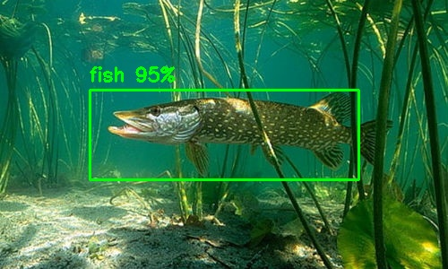

# ML_test
Щоб на тренувати гарний детектор, найперше шо потрібно зробити - це зрозуміти, умови в яких буде працювати цей детектор. До прикладу:
	a) якщо ми хочемо детектувати риб під водою то нам потрібно створювати датасет з спотвореннями як під водою. 
	b) якщо ми тренуємо щось дуже маленьке з великої дистанції, то підбирати масштаб датасету щоб все було маленьке.
	с) якщо це в нас моушин камера, яка дуже швидко рухається то детектор має бути натренований на забоюрених зображеннях від моушин блюра.

 

	
	Чому це важливо - бо якщо ми натренуємо детектор на ідеальних зображеннях, а реальні будть заблюрені то він не буде працювати. Тому щоб отримати нам потрібно зрозуміти які нюанси наших даних та створити або ідентичні, або створити різноманітні які охоплюють всі робочі режими.
	
	
1. 
