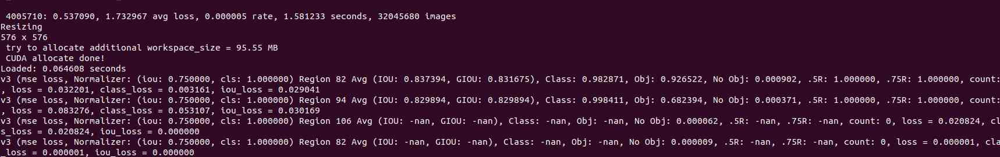
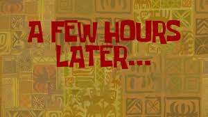

# Як натренувати гарний детектор

Щоб натренувати гарний детектор, найперше що потрібно зробити — це зрозуміти умови, в яких буде працювати цей детектор. До прикладу:

a) якщо ми хочемо працювати в темноті чи тумані, то нам потрібно створювати датасет зі спотвореннями, як у темноті чи тумані.

b) якщо ми тренуємо щось дуже маленьке з великої дистанції, то потрібно підібрати масштаб датасету так, щоб все було маленьке.

c) якщо це у нас моушн-камера, яка дуже швидко рухається, то детектор має бути натренований на зображеннях, зіпсованих моушн-блюром.

<p align="center">
  
</p>

Чому це важливо — для того щоб детектор працював дані мають бути схожі до тих на яких він буде працювати. Тому нам потрібно зрозуміти нюанси наших даних і створити або ідентичні, або різноманітні дані, які охоплюють усі робочі режими. (розміри об"єктів, point of view, їх можливі спотворення і тд)

## 1. Формуємо ТЗ для нашого детектора

Дивимось на дані, з якими ми будемо працювати:

<p align="center">
  
</p>

Ми бачимо:

1) Гарна якість
2) Розміри від 8×12 до 270×330*
3) Зображення може бути з різних ракурсів (зверху, збоку, спереду, під кутами)

Відповідно формуємо ТЗ для нашого детектора:

1) Ми маємо забезпечити розміри від 8×12 до 270×330*
2) Різні точки огляду (point of view)
3) Ми не аугментуємо для блюру, туману чи подібних ефектів

## 2. Data Annotation або створення датасету

Для створення дійсно хороших детекторів зазвичай потрібні сотні тисяч зображень у датасеті. Але я не хочу сьогодні вручну розмічати мільйон кадрів :) До того ж у завданні прямо сказано:

> "The auto-labeling step is the heart of the exercise"

Як можна вирішити цю задачу?

<p align="center">
  
</p>

Використаємо фантазію та розглянемо декілька можливих підходів:

1. **Трекер** — оскільки ми працюємо з відеоданими, можна підключити object tracker до автомобіля та автоматично отримати розмітку для всіх кадрів із цією машиною.

2. **Генерація даних** — можна створити величезний синтетичний датасет за допомогою генеративних моделей. Недолік підходу — висока ресурсозатратність.

3. **Інші підходи** — можна придумати ще багато варіантів, комбінуючи різні ML та CV техніки.

4. **Аугментація** — оскільки на співбесіді прозвучала фраза *"а що там аугментувати?"*, я вирішив обрати саме цей підхід :)  
   Ідея полягає в тому, щоб показати, як можна створити великий датасет майже виключно за рахунок аугментацій.

---


## 3. The Auto-Labeling

Для автолейбелінгу ми створимо скрипт, який за допомогою аугментацій генеруватиме велику кількість нових даних.

Усе, що нам потрібно — це вручну розмітити декілька якісних зображень, наприклад 5–10 кадрів.

Після цього ми зможемо автоматично отримати тисячі нових прикладів — наприклад 1000–5000 зображень.

Для цього беремо декілька найбільш деталізованих зображень автомобілів із різних ракурсів:

1. 2 автомобілі зверху у хорошій якості
2. 2 автомобілі збоку у хорошій якості
3. Автомобіль ззаду
4. Автомобіль спереду

<p align="center">
  
</p>

### The auto-labeling code example is available in the `./augmentaion` folder

---

## 4. Training

### 1. Prepare dataset configuration

Prepare your dataset configuration file, for example `data.yaml`.

### 2. Run training
```
ython3 train.py --workers 8  --batch-size 16 --data ./data.yaml  --img 640 640 --cfg cfg/training/model.yaml --weights '' --name moled --hyp data/hyp.params.yaml 
```
<p align="center">
  
</p>

Look how beautifully the loss function decreases :)

### 3. Wait

<p align="center">
  
</p>


