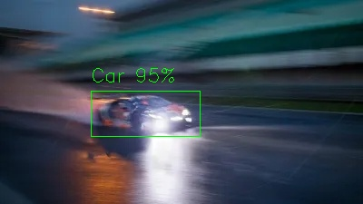
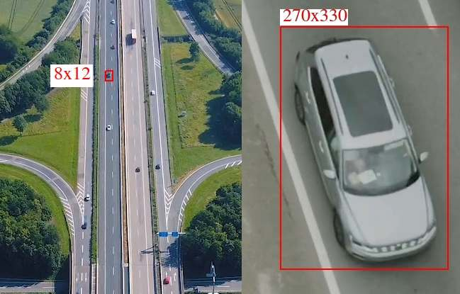
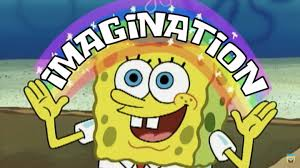
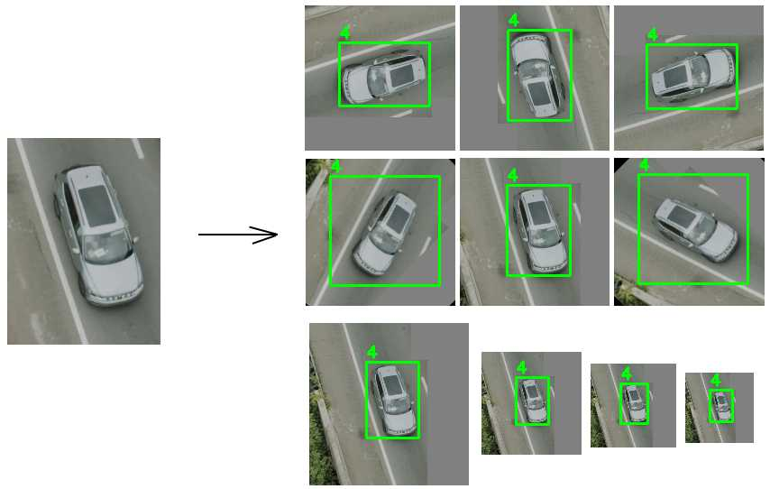

# Як натренувати гарний детектор

Щоб натренувати гарний детектор, найперше що потрібно зробити — це зрозуміти умови, в яких буде працювати цей детектор. До прикладу:

a) якщо ми хочемо працювати в темноті чи тумані, то нам потрібно створювати датасет зі спотвореннями, як у темноті чи тумані.

b) якщо ми тренуємо щось дуже маленьке з великої дистанції, то потрібно підібрати масштаб датасету так, щоб все було маленьке.

c) якщо це у нас моушн-камера, яка дуже швидко рухається, то детектор має бути натренований на зображеннях, зіпсованих моушн-блюром.

  

Чому це важливо — для того щоб детектор працював дані мають бути схожі до тих на яких він буде працювати. Тому нам потрібно зрозуміти нюанси наших даних і створити або ідентичні, або різноманітні дані, які охоплюють усі робочі режими. (розміри об"єктів, point of view, їх можливі спотворення і тд)

## 1. Формуємо ТЗ для нашого детектора

Дивимось на дані, з якими ми будемо працювати:

  

Ми бачимо:

1) Гарна якість
2) Розміри від 8×12 до 270×330*
3) Зображення може бути з різних ракурсів (зверху, збоку, спереду, під кутами)

Відповідно формуємо ТЗ для нашого детектора:

1) Ми маємо забезпечити розміри від 8×12 до 270×330*
2) Різні точки огляду (point of view)
3) Ми не аугментуємо для блюру, туману чи подібних ефектів

## 2. Анотація даних або створення датасету

Для створення супер крутих детекторів потрібні сотні тисяч зображень у датасеті, але я не хочу сьогодні розмічати мільйон даних, та й у задачі вказано, що:

> "The auto-labeling step is the heart of the exercise"

Як можна вирішити це завдання?

  

Використаємо нашу фантазію та придумаємо декілька варіантів вирішення:

1) **Трекер** — оскільки у нас відеодані, ми можемо підключити трекер до машини і отримати всі кадри автоматично розміченими для цієї конкретної машини.

2) **Генерація** — можна згенерувати мільйон даних генеративними нейромережами, але є недолік: це ресурсозатратно.

3) Ще мільйон різних варіантів можна придумати, використовуючи фантазію.

4) **Аугментація** — оскільки на співбесіді звучала фраза **а що там аугментувати** то я обираю цей підхід! Щоб показати, як можна вирішити цю задачу і нагенерувати мільйон датасета суто аугментацією

## 3. The auto-labeling

Для автолейбелінгу ми створимо скрипт який за допомогою аугментація створить нам велетенську кучу даних і все шо нам потрібно це розмітити декілька якісних знімків, наприклад 5-10 штучок і це нам дозволить отримати наприклад 1000-5000

Для цього ми беремо декілька найбільш деталізованих зображеннь автомобілів з декількох сторін:
	1) наприклад 2 машинки зверху, в гарній якості
	2) 2 машинки збоку в гарній якості
	3) машинку ззаду
	4) машинку спереду

  

